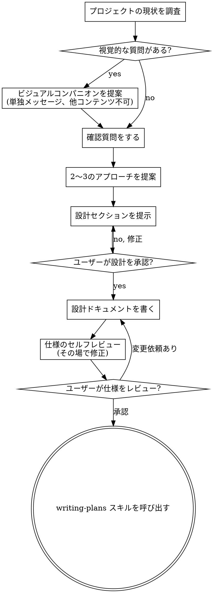

# アイデアを設計に変えるブレインストーミング

自然な対話を通じて、アイデアを完全に形になった設計・仕様へと発展させる。

まずプロジェクトの現状を把握し、次に質問を一つずつ投げかけてアイデアを磨く。何を作るかが明確になったら設計を提示し、ユーザーの承認を得る。

<HARD-GATE>
設計を提示してユーザーが承認するまで、実装スキルの呼び出し・コード記述・プロジェクトのスキャフォールド・その他一切の実装作業を行ってはならない。どんなに単純に見えるプロジェクトでも、これはすべてに適用される。
</HARD-GATE>

## アンチパターン：「これは単純すぎて設計不要」

すべてのプロジェクトはこのプロセスを経る。Todoリスト、単一関数のユーティリティ、設定変更でも同じだ。「単純な」プロジェクトこそ、検討されていない前提が最も多くの無駄な作業を生む。設計は短くてよい（本当に単純なプロジェクトなら数文で十分）が、必ず提示して承認を得ること。

## チェックリスト

以下の項目をすべてタスクとして作成し、順番に完了させること：

1. **プロジェクトの現状を調査する** — ファイル・ドキュメント・最近のコミットを確認
2. **ビジュアルコンパニオンを提案する**（視覚的な質問が予想される場合）— 単独のメッセージで行うこと。他の質問と組み合わせない。下記のビジュアルコンパニオンセクション参照
3. **確認質問をする** — 一度に一つずつ。目的・制約・成功基準を理解する
4. **2〜3のアプローチを提案する** — トレードオフと推薦案を示す
5. **設計を提示する** — 複雑さに応じたセクション分けで、各セクションの後に承認を得る
6. **設計ドキュメントを書く** — `docs/superpowers/specs/YYYY-MM-DD-<トピック>-design.md` に保存してコミット
7. **仕様のセルフレビュー** — プレースホルダー・矛盾・曖昧さ・スコープを確認（下記参照）
8. **ユーザーに仕様をレビューしてもらう** — 実装前に仕様ファイルのレビューを依頼する
9. **実装への移行** — writing-plans スキルを呼び出して実装計画を作成する

## プロセスフロー

**最終ゴールは writing-plans の呼び出しだ。** frontend-design・mcp-builder・その他の実装スキルは呼び出してはいけない。ブレインストーミング後に呼び出すスキルは writing-plans のみ。

## プロセスの詳細

**アイデアを理解する：**

- まずプロジェクトの現状を確認する（ファイル・ドキュメント・最近のコミット）
- 詳細な質問をする前にスコープを評価する：リクエストが複数の独立したサブシステムを含む場合（例：「チャット・ファイルストレージ・課金・分析を備えたプラットフォームを作る」）、まずそれを指摘する。分解が必要なプロジェクトの詳細を磨く質問に時間をかけてはいけない
- プロジェクトが単一の仕様に収まらない大きさの場合、ユーザーがサブプロジェクトに分解するのを助ける：独立した部分は何か、どう関係するか、どの順番で作るか。その後、最初のサブプロジェクトを通常の設計フローでブレインストーミングする。各サブプロジェクトは独自の仕様→計画→実装サイクルを持つ
- 適切なスコープのプロジェクトには、一度に一つずつ質問してアイデアを磨く
- 可能な限り選択肢形式の質問を使う。自由記述も可
- 一メッセージ一質問。トピックをさらに深掘りしたい場合は、複数の質問に分ける
- 理解すべきこと：目的・制約・成功基準

**アプローチを探る：**

- トレードオフを含む2〜3の異なるアプローチを提案する
- 推薦案と理由を示しながら会話形式で選択肢を提示する
- 推薦案を最初に挙げ、なぜそれを勧めるかを説明する

**設計を提示する：**

- 何を作るかを理解したと思ったら設計を提示する
- 各セクションを複雑さに合わせてスケールする：シンプルなら数文、ニュアンスがある場合は最大200〜300語
- 各セクションの後に「ここまでで問題ないですか？」と確認する
- カバーすること：アーキテクチャ・コンポーネント・データフロー・エラーハンドリング・テスト
- 何かが理解できない場合は、戻って明確にする準備をする

**分離と明確さを設計する：**

- システムを、明確な目的・明確なインターフェース・独立して理解とテストができる小さな単位に分解する
- 各単位について答えられるべきこと：何をするのか、どう使うのか、何に依存するのか
- 内部を読まずに単位が何をするか理解できるか？消費者を壊さずに内部を変更できるか？できなければ境界に問題がある
- 小さくて境界の明確な単位は作業しやすい。ファイルが大きくなったら、それはやり過ぎのサインだ

**既存コードベースでの作業：**

- 変更を提案する前に現在の構造を調査する。既存のパターンに従う
- 作業に影響する既存コードの問題（大きくなりすぎたファイル・不明確な境界・絡み合った責任）がある場合、設計の一部として改善を含める
- 無関係なリファクタリングは提案しない。現在の目標に集中する

## 設計の後

**ドキュメント：**

- 承認された設計（仕様）を `docs/superpowers/specs/YYYY-MM-DD-<トピック>-design.md` に書く
  （ユーザーの設定がある場合はその場所が優先される）
- 利用可能であれば elements-of-style:writing-clearly-and-concisely スキルを使用する
- 設計ドキュメントをgitにコミットする

**仕様のセルフレビュー：**
仕様ドキュメントを書いた後、新鮮な目で見直す：

1. **プレースホルダーチェック：** "TBD"・"TODO"・未完成セクション・曖昧な要件はないか？修正する
2. **内部一貫性：** セクション間に矛盾はないか？アーキテクチャと機能説明は一致しているか？
3. **スコープチェック：** 単一の実装計画に収まる規模か、分解が必要か？
4. **曖昧さチェック：** 2通りに解釈できる要件はないか？あれば1つを選んで明確にする

問題があれば、その場で修正する。再レビューは不要。修正して次へ進む。

**ユーザーレビューゲート：**
仕様レビューループが通ったら、実装前にユーザーに仕様をレビューしてもらう：

> 「仕様を `<パス>` に書いてコミットしました。実装計画を作成する前に確認していただき、変更があればお知らせください。」

ユーザーの回答を待つ。変更を依頼された場合は修正し、仕様レビューループを再実行する。ユーザーが承認したら次へ進む。

**実装：**

- writing-plans スキルを呼び出して詳細な実装計画を作成する
- 他のスキルは呼び出さない。次のステップは writing-plans だ

## 重要な原則

- **一度に一質問** — 複数の質問で圧倒しない
- **選択肢形式を優先** — 可能な場合は自由記述より答えやすい
- **YAGNI を徹底する** — すべての設計から不要な機能を取り除く
- **代替案を探る** — 決める前に必ず2〜3のアプローチを提案する
- **段階的な検証** — 設計を提示し、次へ進む前に承認を得る
- **柔軟に対応する** — 何かが理解できない場合は戻って明確にする

## ビジュアルコンパニオン

ブレインストーミング中にモックアップ・図・視覚的な選択肢を見せるためのブラウザベースのコンパニオン。ツールとして利用可能。コンパニオンを受け入れることは今後の質問で利用可能になることを意味するが、すべての質問をブラウザで行うことを意味しない。

**コンパニオンを提案するとき：** 視覚的なコンテンツを含む質問が予想される場合、同意を得るために一度提案する：
> 「これから取り組む内容の中には、ブラウザで見せた方が分かりやすいものがあるかもしれません。進めながらモックアップ・図・比較などを表示できます。この機能はまだ新しくトークンを多く消費します。試してみますか？（ローカルURLを開く必要があります）」

**この提案は単独のメッセージでなければならない。** 確認質問・コンテキストのまとめ・その他のコンテンツと組み合わせてはいけない。返答を待ってから続ける。断られた場合はテキストのみでブレインストーミングを続ける。

**質問ごとの判断：** ユーザーが承認した後でも、各質問についてブラウザを使うかターミナルを使うかを判断する。判断基準：**読むより見た方が理解しやすいか？**

- **ブラウザを使う：** 視覚的なコンテンツ — モックアップ・ワイヤーフレーム・レイアウト比較・アーキテクチャ図
- **ターミナルを使う：** テキストコンテンツ — 要件の質問・概念的な選択肢・トレードオフのリスト・A/B/C/Dテキストオプション・スコープ決定

UIトピックの質問が自動的に視覚的な質問になるわけではない。「このコンテキストでパーソナリティとはどういう意味か？」は概念的な質問なのでターミナルを使う。「どちらのウィザードレイアウトがよいか？」は視覚的な質問なのでブラウザを使う。

コンパニオンに同意してもらえたら、詳細なガイドを読んでから進める：
`skills/brainstorming/visual-companion.md`
