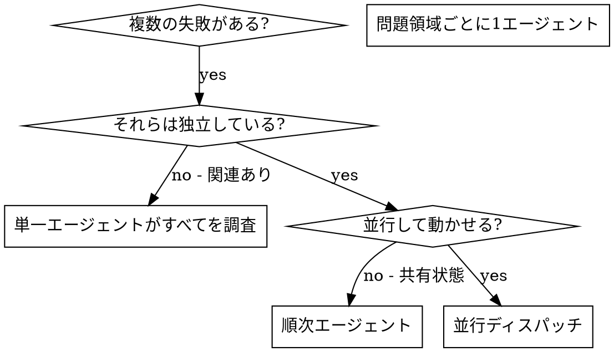

# 並行エージェントのディスパッチ

## 概要

専門的なエージェントに独立したコンテキストでタスクを委譲する。指示とコンテキストを正確に作成することで、エージェントは集中してタスクに成功できる。エージェントは自分のセッションのコンテキストや履歴を引き継いではならない。エージェントに必要なものだけを正確に構築する。これにより、自分のコンテキストもコーディネーション作業のために保持できる。

異なるテストファイル・異なるサブシステム・異なるバグにまたがる複数の無関係な失敗がある場合、順番に調査するのは時間の無駄だ。各調査は独立しており、並行して行うことができる。

**コア原則：** 独立した問題領域ごとに1つのエージェントをディスパッチする。並行して動かす。

## 使用するタイミング



**使用する場合：**
- 3件以上のテストファイルが異なる根本原因で失敗している
- 複数のサブシステムが独立して壊れている
- 各問題が他の問題のコンテキストなしに理解できる
- 調査間で共有状態がない

**使用しない場合：**
- 失敗が関連している（1つ直せば他も直る可能性がある）
- システム全体の状態を理解する必要がある
- エージェントが互いに干渉する可能性がある

## パターン

### 1. 独立したドメインを特定する

何が壊れているかでグループ化する：
- ファイルAのテスト：ツール承認フロー
- ファイルBのテスト：バッチ完了の動作
- ファイルCのテスト：中断機能

各ドメインは独立している。ツール承認を直しても中断テストには影響しない。

### 2. 焦点を絞ったエージェントタスクを作成する

各エージェントが受け取るもの：
- **特定のスコープ：** 1つのテストファイルまたはサブシステム
- **明確な目標：** これらのテストを通過させる
- **制約：** 他のコードを変更しない
- **期待する出力：** 発見したことと修正したことのサマリー

### 3. 並行してディスパッチする

```typescript
// Claude Code / AI環境にて
Task("agent-tool-abort.test.ts の失敗を修正")
Task("batch-completion-behavior.test.ts の失敗を修正")
Task("tool-approval-race-conditions.test.ts の失敗を修正")
// 3つすべてが並行して実行される
```

### 4. レビューして統合する

エージェントが戻ってきたら：
- 各サマリーを読む
- 修正が競合しないことを確認する
- フルテストスイートを実行する
- すべての変更を統合する

## エージェントプロンプトの構造

良いエージェントプロンプトは：
1. **焦点が絞られている** — 明確な1つの問題領域
2. **自己完結している** — 問題を理解するために必要なすべてのコンテキスト
3. **出力が具体的** — エージェントは何を返すべきか？

```markdown
src/agents/agent-tool-abort.test.ts で失敗している3件のテストを修正してください：

1. "部分的な出力キャプチャでツールが中断されること" - メッセージに 'interrupted at' が期待される
2. "完了と中断が混在するツールを処理すること" - 高速ツールが完了ではなく中断されている
3. "pendingToolCountを適切に追跡すること" - 3件の結果が期待されるが0件しか得られない

これらはタイミング/レースコンディションの問題です。タスク：

1. テストファイルを読んで各テストが何を検証しているか理解する
2. 根本原因を特定 - タイミングの問題か実際のバグか？
3. 以下の方法で修正する：
   - 任意のタイムアウトをイベントベースの待機に置き換える
   - 中断実装のバグが見つかった場合は修正する
   - 動作が変わった場合はテストの期待値を調整する

単にタイムアウトを増やさないこと。本当の問題を見つけること。

戻り値：発見したことと修正したことのサマリー。
```

## よくある間違い

**❌ 広すぎる：** 「すべてのテストを修正して」 - エージェントが迷子になる
**✅ 具体的：** 「agent-tool-abort.test.ts を修正して」 - 焦点が絞られたスコープ

**❌ コンテキストなし：** 「レースコンディションを修正して」 - エージェントがどこか分からない
**✅ コンテキストあり：** エラーメッセージとテスト名を貼り付ける

**❌ 制約なし：** エージェントが何でもリファクタリングするかもしれない
**✅ 制約あり：** 「本番コードを変更しないこと」や「テストのみ修正すること」

**❌ 曖昧な出力：** 「直して」 - 何が変わったか分からない
**✅ 具体的：** 「根本原因と変更のサマリーを返すこと」

## 使用しない場合

**関連した失敗：** 1つを直すと他も直る可能性がある - まず一緒に調査する
**完全なコンテキストが必要：** システム全体を見ないと理解できない
**探索的デバッグ：** 何が壊れているかまだ分からない
**共有状態：** エージェントが干渉する（同じファイルを編集、同じリソースを使用）

## セッションからの実例

**シナリオ：** 大規模リファクタリング後に3ファイルで6件のテスト失敗

**失敗：**
- agent-tool-abort.test.ts：3件の失敗（タイミングの問題）
- batch-completion-behavior.test.ts：2件の失敗（ツールが実行されない）
- tool-approval-race-conditions.test.ts：1件の失敗（実行回数=0）

**判断：** 独立したドメイン - 中断ロジックはバッチ完了とも、レースコンディションとも別

**ディスパッチ：**
```
エージェント1 → agent-tool-abort.test.ts を修正
エージェント2 → batch-completion-behavior.test.ts を修正
エージェント3 → tool-approval-race-conditions.test.ts を修正
```

**結果：**
- エージェント1：タイムアウトをイベントベースの待機に置き換えた
- エージェント2：イベント構造のバグを修正（threadIdの位置が間違っていた）
- エージェント3：非同期ツール実行の完了待ちを追加した

**統合：** すべての修正が独立しており競合なし。フルスイートがグリーンに

**節約時間：** 3つの問題を順次ではなく並行で解決

## 主なメリット

1. **並列化** — 複数の調査が同時に行われる
2. **集中** — 各エージェントのスコープが狭く、追跡するコンテキストが少ない
3. **独立性** — エージェントが互いに干渉しない
4. **速度** — 1つ分の時間で3つの問題を解決

## 検証

エージェントが戻ってきたら：
1. **各サマリーをレビューする** — 何が変わったかを理解する
2. **競合を確認する** — エージェントが同じコードを編集したか？
3. **フルスイートを実行する** — すべての修正が一緒に機能するか確認する
4. **スポットチェック** — エージェントは系統的なエラーを犯すことがある

## 現実の効果

デバッグセッション（2025-10-03）より：
- 3ファイルで6件の失敗
- 3エージェントを並行してディスパッチ
- すべての調査が同時に完了
- すべての修正が正常に統合された
- エージェントの変更間の競合はゼロ
