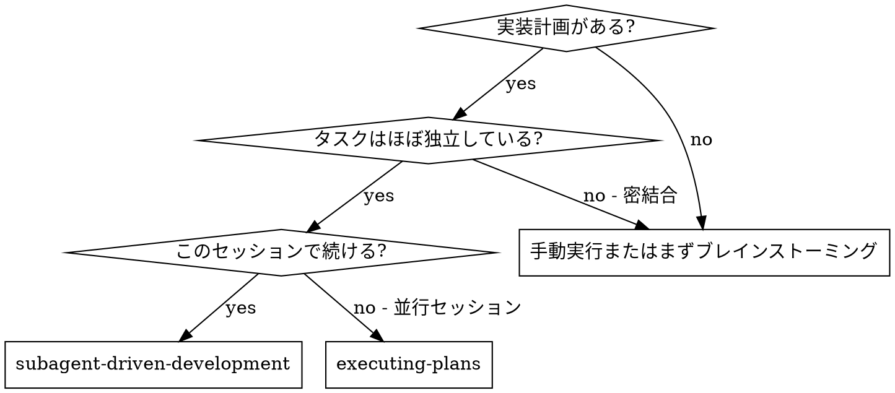
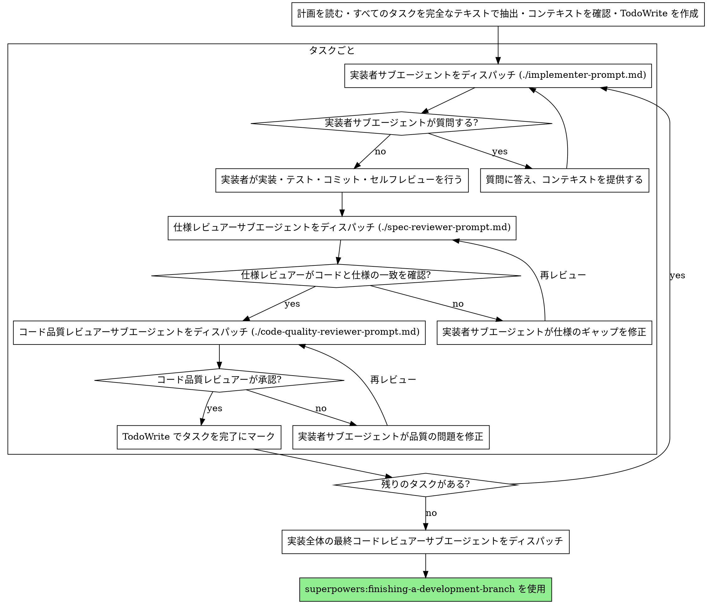

# サブエージェント駆動の開発

タスクごとに新鮮なサブエージェントをディスパッチして計画を実行し、各タスクの後に2段階のレビューを行う：まず仕様準拠のレビュー、次にコード品質のレビュー。

**サブエージェントを使う理由：** 独立したコンテキストを持つ専門エージェントにタスクを委譲する。指示とコンテキストを正確に作成することで、エージェントは集中してタスクに成功できる。エージェントは自分のセッションのコンテキストや履歴を引き継いではならない。エージェントに必要なものだけを正確に構築する。これにより自分のコンテキストもコーディネーション作業のために保持できる。

**コア原則：** タスクごとに新鮮なサブエージェント + 2段階レビュー（仕様次にコード品質）= 高品質・高速イテレーション

**継続実行：** タスク間でヒューマンパートナーに確認するために停止しない。停止する理由は：解決できないBLOCKEDステータス・進行を妨げる本物の曖昧さ・すべてのタスクの完了、のいずれかのみ。「続けますか？」のプロンプトや進捗サマリーは時間の無駄 — 計画を実行するよう依頼されたのだから実行する。

## 使用するとき



**vs. 計画の実行（並行セッション）：**
- 同じセッション（コンテキストの切り替えなし）
- タスクごとに新鮮なサブエージェント（コンテキストの汚染なし）
- 各タスクの後に2段階レビュー：仕様準拠、次にコード品質
- 高速イテレーション（タスク間でヒューマンインループなし）

## プロセス



## モデルの選択

コストを節約してスピードを上げるために、各ロールが処理できる最も非力なモデルを使用する。

**機械的な実装タスク**（独立した関数・明確な仕様・1〜2ファイル）：高速で安価なモデルを使用。計画が明確に指定されている場合、ほとんどの実装タスクは機械的だ。

**統合と判断のタスク**（複数ファイルの調整・パターンマッチング・デバッグ）：標準モデルを使用。

**アーキテクチャ・設計・レビューのタスク**：最も高性能なモデルを使用。

**タスクの複雑さのシグナル：**
- 完全な仕様で1〜2ファイルに触れる → 安価なモデル
- 統合に関わる複数ファイルに触れる → 標準モデル
- 設計の判断またはコードベースの幅広い理解が必要 → 最も高性能なモデル

## 実装者のステータスへの対応

実装者サブエージェントは4つのステータスの1つを報告する。それぞれ適切に対応する：

**DONE：** 仕様準拠レビューへ進む。

**DONE_WITH_CONCERNS：** 実装者は作業を完了したが疑念を示した。進む前に懸念を読む。懸念が正確さやスコープに関するものであれば、レビュー前に対処する。観察的なもの（例：「このファイルが大きくなっている」）であれば、メモして通常どおりレビューへ進む。

**NEEDS_CONTEXT：** 実装者は提供されなかった情報を必要としている。不足しているコンテキストを提供して再ディスパッチする。

**BLOCKED：** 実装者はタスクを完了できない。ブロッカーを評価する：
1. コンテキストの問題なら、より多くのコンテキストを提供して同じモデルで再ディスパッチする
2. タスクがより多くの推論を必要とするなら、より高性能なモデルで再ディスパッチする
3. タスクが大きすぎるなら、より小さな部分に分割する
4. 計画自体が間違っているなら、ヒューマンにエスカレートする

**絶対に** エスカレーションを無視したり、変更なしに同じモデルに再試行させたりしない。実装者が詰まっていると言ったなら、何かを変える必要がある。

## プロンプトテンプレート

- `./implementer-prompt.md` — 実装者サブエージェントをディスパッチ
- `./spec-reviewer-prompt.md` — 仕様準拠レビュアーサブエージェントをディスパッチ
- `./code-quality-reviewer-prompt.md` — コード品質レビュアーサブエージェントをディスパッチ

## ワークフロー例

```
自分：Subagent-Driven Development を使ってこの計画を実行します。

[計画ファイルを一度読む：docs/superpowers/plans/feature-plan.md]
[すべての5タスクを完全なテキストとコンテキストで抽出]
[すべてのタスクで TodoWrite を作成]

タスク1：フックインストールスクリプト

[タスク1のテキストとコンテキストを取得（既に抽出済み）]
[フルタスクテキスト + コンテキストで実装サブエージェントをディスパッチ]

実装者：「始める前に — フックはユーザーレベルかシステムレベルか？」

自分：「ユーザーレベル (~/.config/superpowers/hooks/)」

実装者：「了解しました。今実装します...」
[後で] 実装者：
  - install-hook コマンドを実装した
  - テストを追加、5/5 通過
  - セルフレビュー：--force フラグが欠けていることに気づいて追加した
  - コミット済み

[仕様準拠レビュアーをディスパッチ]
仕様レビュアー：✅ 仕様準拠 — すべての要件を満たし、余分なものなし

[git SHA を取得、コード品質レビュアーをディスパッチ]
コードレビュアー：強み：良いテストカバレッジ、クリーン。問題：なし。承認。

[タスク1を完了にマーク]

タスク2：リカバリーモード

[タスク2のテキストとコンテキストを取得（既に抽出済み）]
[フルタスクテキスト + コンテキストで実装サブエージェントをディスパッチ]

実装者：[質問なし、進む]
実装者：
  - verify/repairモードを追加した
  - 8/8 テスト通過
  - セルフレビュー：問題なし
  - コミット済み

[仕様準拠レビュアーをディスパッチ]
仕様レビュアー：❌ 問題あり：
  - 欠落：進捗レポート（仕様では「100項目ごとに報告」と記載）
  - 余分：--json フラグを追加（要求されていない）

[実装者が問題を修正]
実装者：--json フラグを削除し、進捗レポートを追加した

[仕様レビュアーが再レビュー]
仕様レビュアー：✅ 仕様準拠

[コード品質レビュアーをディスパッチ]
コードレビュアー：強み：しっかりしている。問題（Important）：マジックナンバー（100）

[実装者が修正]
実装者：PROGRESS_INTERVAL 定数を抽出した

[コードレビュアーが再レビュー]
コードレビュアー：✅ 承認

[タスク2を完了にマーク]

...

[すべてのタスク完了後]
[最終コードレビュアーをディスパッチ]
最終レビュアー：すべての要件を満たしている、マージ準備OK

完了！
```

## メリット

**手動実行との比較：**
- サブエージェントが自然にTDDに従う
- タスクごとに新鮮なコンテキスト（混乱なし）
- 並行して安全（サブエージェントが干渉しない）
- サブエージェントが質問できる（作業前も作業中も）

**計画の実行との比較：**
- 同じセッション（ハンドオフなし）
- 継続的な進捗（待ちなし）
- レビューチェックポイントが自動

**効率向上：**
- ファイル読み取りのオーバーヘッドなし（コントローラーが完全なテキストを提供）
- コントローラーが必要なコンテキストだけをキュレートする
- サブエージェントが最初から完全な情報を持つ
- 質問が作業前に浮かび上がる（後からではなく）

**品質ゲート：**
- セルフレビューがハンドオフ前に問題を捕捉する
- 2段階レビュー：仕様準拠、次にコード品質
- レビューループが修正が実際に機能することを確認する
- 仕様準拠が過剰・不足構築を防ぐ
- コード品質が実装が適切に構築されていることを確認する

**コスト：**
- より多くのサブエージェント呼び出し（実装者 + タスクごとに2レビュアー）
- コントローラーがより多くの準備作業を行う（最初にすべてのタスクを抽出）
- レビューループがイテレーションを追加する
- しかし早期に問題を捕捉する（後でデバッグするより安上がり）

## 禁止事項

**絶対にしないこと：**
- ユーザーの明示的な同意なしに main/master ブランチで実装を開始する
- レビューをスキップする（仕様準拠またはコード品質）
- 未修正の問題を抱えて進む
- 複数の実装サブエージェントを並行してディスパッチする（競合が発生する）
- サブエージェントに計画ファイルを読ませる（代わりに完全なテキストを提供する）
- シーンセッティングのコンテキストをスキップする（サブエージェントはタスクがどこに収まるかを理解する必要がある）
- サブエージェントの質問を無視する（進める前に答える）
- 仕様準拠で「まあいいか」を許容する（仕様レビュアーが問題を見つけた = 完了ではない）
- レビューループをスキップする（レビュアーが問題を見つけた = 実装者が修正 = 再レビュー）
- 実装者のセルフレビューが実際のレビューに取って代わることを許す（両方が必要）
- **仕様準拠が ✅ になる前にコード品質レビューを開始する**（順番が間違い）
- どちらかのレビューに未解決の問題がある状態で次のタスクに移る

**サブエージェントが質問した場合：**
- 明確かつ完全に答える
- 必要に応じて追加のコンテキストを提供する
- 実装に急かさない

**レビュアーが問題を見つけた場合：**
- 実装者（同じサブエージェント）が修正する
- レビュアーが再レビューする
- 承認されるまで繰り返す
- 再レビューをスキップしない

**サブエージェントがタスクに失敗した場合：**
- 具体的な指示で修正サブエージェントをディスパッチする
- 手動で修正しようとしない（コンテキストの汚染）

## 連携

**必須ワークフロースキル：**
- **superpowers:using-git-worktrees** — 独立したワークスペースを確保する（作成または既存を確認）
- **superpowers:writing-plans** — このスキルが実行する計画を作成する
- **superpowers:requesting-code-review** — レビュアーサブエージェントのコードレビューテンプレート
- **superpowers:finishing-a-development-branch** — すべてのタスク完了後に開発を完了させる

**サブエージェントが使用すべきスキル：**
- **superpowers:test-driven-development** — サブエージェントが各タスクでTDDに従う

**代替ワークフロー：**
- **superpowers:executing-plans** — 同セッション実行の代わりに並行セッションで使用
