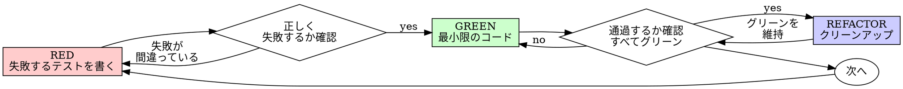

# テスト駆動開発（TDD）

## 概要

テストを先に書く。失敗を確認する。通過する最小限のコードを書く。

**コア原則：** テストが失敗するのを確認しなければ、テストが正しいものをテストしているかどうか分からない。

**このルールの文言に違反することは、ルールの精神に違反することだ。**

## 使用するとき

**常に：**
- 新機能
- バグ修正
- リファクタリング
- 動作の変更

**例外（ヒューマンパートナーに確認する）：**
- 使い捨てのプロトタイプ
- 生成されたコード
- 設定ファイル

「今回だけTDDをスキップしよう」と思っている？ 停止する。それは合理化だ。

## 鉄則

```
失敗するテストなしに本番コードを書いてはならない
```

テストより前にコードを書いた？ 削除する。最初からやり直す。

**例外なし：**
- 「参照として」保持しない
- テストを書きながら「適応させ」ない
- それを見ない
- 削除は削除を意味する

テストから新鮮に実装する。以上。

## レッド・グリーン・リファクター



### RED — 失敗するテストを書く

何が起きるべきかを示す最小限のテストを1つ書く。

<Good>
```typescript
test('失敗した操作を3回リトライする', async () => {
  let attempts = 0;
  const operation = () => {
    attempts++;
    if (attempts < 3) throw new Error('fail');
    return 'success';
  };

  const result = await retryOperation(operation);

  expect(result).toBe('success');
  expect(attempts).toBe(3);
});
```
明確な名前、実際の動作をテスト、一つのこと
</Good>

<Bad>
```typescript
test('リトライが動く', async () => {
  const mock = jest.fn()
    .mockRejectedValueOnce(new Error())
    .mockRejectedValueOnce(new Error())
    .mockResolvedValueOnce('success');
  await retryOperation(mock);
  expect(mock).toHaveBeenCalledTimes(3);
});
```
曖昧な名前、コードではなくモックをテスト
</Bad>

**要件：**
- 一つの動作
- 明確な名前
- 実際のコード（避けられない場合のみモック）

### REDを確認する — 失敗を確認する

**必須。絶対にスキップしない。**

```bash
npm test path/to/test.test.ts
```

確認する：
- テストが失敗する（エラーではない）
- 失敗メッセージが期待通り
- 機能が欠けているために失敗する（タイポではない）

**テストが通過する？** 既存の動作をテストしている。テストを修正する。

**テストがエラーになる？** エラーを修正し、正しく失敗するまで再実行する。

### GREEN — 最小限のコード

テストを通過させる最もシンプルなコードを書く。

<Good>
```typescript
async function retryOperation<T>(fn: () => Promise<T>): Promise<T> {
  for (let i = 0; i < 3; i++) {
    try {
      return await fn();
    } catch (e) {
      if (i === 2) throw e;
    }
  }
  throw new Error('unreachable');
}
```
通過させるのに十分なだけ
</Good>

<Bad>
```typescript
async function retryOperation<T>(
  fn: () => Promise<T>,
  options?: {
    maxRetries?: number;
    backoff?: 'linear' | 'exponential';
    onRetry?: (attempt: number) => void;
  }
): Promise<T> {
  // YAGNI
}
```
過剰エンジニアリング
</Bad>

機能を追加しない、他のコードをリファクタリングしない、テスト以上に「改善」しない。

### GREENを確認する — 通過を確認する

**必須。**

```bash
npm test path/to/test.test.ts
```

確認する：
- テストが通過する
- 他のテストがまだ通過する
- 出力がクリーン（エラー・警告なし）

**テストが失敗する？** コードを修正する、テストではなく。

**他のテストが失敗する？** 今すぐ修正する。

### REFACTOR — クリーンアップ

グリーンの後のみ：
- 重複を削除する
- 名前を改善する
- ヘルパーを抽出する

テストをグリーンに保つ。動作を追加しない。

### 繰り返す

次の機能の次の失敗するテスト。

## 良いテスト

| 品質 | 良い | 悪い |
|------|------|------|
| **最小限** | 一つのこと。名前に「かつ」が入る？分割する。 | `test('メールとドメインと空白を検証する')` |
| **明確** | 名前が動作を説明する | `test('test1')` |
| **意図を示す** | 望ましいAPIを示す | コードが何をすべきかを隠す |

## 順序が重要な理由

**「後でテストを書いて確認する」**

後から書かれたテストはすぐに通過する。すぐに通過することは何も証明しない：
- 間違ったものをテストしているかもしれない
- 動作ではなく実装をテストしているかもしれない
- 忘れたエッジケースを見逃すかもしれない
- バグを捕捉するのを見たことがない

テスト先行はテストが失敗するのを確認させる。それが実際に何かをテストしていることを証明する。

**「すべてのエッジケースを手動でテスト済み」**

手動テストはアドホックだ。すべてをテストしたと思っているが：
- 何をテストしたかの記録がない
- コードが変わったときに再実行できない
- プレッシャー下でケースを忘れやすい
- 「試したときは動いた」≠ 包括的

自動テストは体系的だ。毎回同じように実行される。

**「X時間の作業を削除するのは無駄」**

サンクコストの誤謬だ。時間はすでに過ぎた。今の選択肢：
- 削除してTDDで書き直す（X時間多く、高い信頼性）
- 保持して後からテストを追加する（30分、低い信頼性、バグの可能性あり）

「無駄」は信頼できないコードを保持することだ。実際のテストなしに機能するコードは技術的負債だ。

**「TDDは教条主義的、実用的であることは適応を意味する」**

TDD は実用的だ：
- コミット前にバグを見つける（後でデバッグするより速い）
- リグレッションを防ぐ（テストが壊れを即座に捕捉する）
- 動作を文書化する（テストがコードの使い方を示す）
- リファクタリングを可能にする（自由に変更し、テストが壊れを捕捉する）

「実用的な」ショートカット = 本番でのデバッグ = より遅い。

**「後からのテストも同じ目標を達成する — 精神であって儀式ではない」**

いいえ。後からのテストは「これは何をするか？」に答える。先のテストは「これは何をすべきか？」に答える。

後からのテストは実装に偏っている。作ったものをテストし、必要なものをテストしない。思い出したエッジケースを確認する（思い出せていない）。

先のテストは実装前にエッジケースを発見させる。後からのテストはすべてを思い出したことを確認する（できていない）。

30分のテスト後 ≠ TDD。カバレッジは得られるが、テストが機能することの証明を失う。

## よくある合理化

| 言い訳 | 現実 |
|--------|------|
| 「テストするには単純すぎる」 | 単純なコードが壊れる。テストに30秒かかる。 |
| 「後でテストする」 | 即座に通過するテストは何も証明しない。 |
| 「後からのテストも同じ目標を達成する」 | 後からのテスト = 「これは何をするか？」先のテスト = 「これは何をすべきか？」 |
| 「すでに手動でテスト済み」 | アドホック ≠ 体系的。記録なし、再実行不可。 |
| 「X時間を削除するのは無駄」 | サンクコストの誤謬。未検証のコードを保持することが技術的負債。 |
| 「参照として保持し、最初にテストを書く」 | 適応させるだろう。それは後からのテストだ。削除は削除を意味する。 |
| 「まず探索が必要」 | いいよ。探索を捨て、TDDで始める。 |
| 「テストが難しい = 設計が不明確」 | テストを聞く。テストが難しい = 使いにくい。 |
| 「TDDは遅くする」 | TDDはデバッグより速い。実用的 = テスト先行。 |
| 「手動テストの方が速い」 | 手動ではエッジケースが証明できない。毎回変更のたびに再テストする。 |
| 「既存コードにテストがない」 | 改善している。既存コードにテストを追加する。 |

## 要注意サイン — 停止して最初からやり直す

- テストより前のコード
- 実装後のテスト
- テストが即座に通過する
- テストがなぜ失敗したか説明できない
- 「後で」追加されたテスト
- 「今回だけ」の合理化
- 「すでに手動でテスト済み」
- 「後からのテストも同じ目的を達成する」
- 「精神であって儀式ではない」
- 「参照として保持する」または「既存コードを適応させる」
- 「すでにX時間費やした、削除するのは無駄」
- 「TDDは教条主義的、私は実用的になっている」
- 「これは違う、なぜなら...」

**これらすべては：コードを削除する。TDDで最初からやり直す。**

## 例：バグ修正

**バグ：** 空のメールが受け付けられる

**RED**
```typescript
test('空のメールを拒否する', async () => {
  const result = await submitForm({ email: '' });
  expect(result.error).toBe('メールが必要です');
});
```

**REDを確認する**
```bash
$ npm test
FAIL: expected 'メールが必要です', got undefined
```

**GREEN**
```typescript
function submitForm(data: FormData) {
  if (!data.email?.trim()) {
    return { error: 'メールが必要です' };
  }
  // ...
}
```

**GREENを確認する**
```bash
$ npm test
PASS
```

**REFACTOR**
必要に応じて複数フィールドの検証を抽出する。

## 確認チェックリスト

作業を完了としてマークする前に：

- [ ] すべての新しい関数/メソッドにテストがある
- [ ] 実装前に各テストが失敗するのを確認した
- [ ] 各テストが期待通りの理由で失敗した（機能が欠けている、タイポではない）
- [ ] 各テストを通過させる最小限のコードを書いた
- [ ] すべてのテストが通過する
- [ ] 出力がクリーン（エラー・警告なし）
- [ ] テストが実際のコードを使用している（避けられない場合のみモック）
- [ ] エッジケースとエラーがカバーされている

すべてのボックスにチェックできない？ TDDをスキップした。最初からやり直す。

## 行き詰まったとき

| 問題 | 解決策 |
|------|--------|
| テストの方法が分からない | 望ましいAPIを書く。最初にアサーションを書く。ヒューマンパートナーに聞く。 |
| テストが複雑すぎる | 設計が複雑すぎる。インターフェースをシンプルにする。 |
| すべてをモックしなければならない | コードが密結合すぎる。依存性の注入を使用する。 |
| テストのセットアップが巨大 | ヘルパーを抽出する。まだ複雑？ 設計をシンプルにする。 |

## デバッグとの統合

バグが見つかった？ それを再現する失敗するテストを書く。TDDサイクルに従う。テストが修正を証明し、リグレッションを防ぐ。

テストなしにバグを修正しない。

## テストのアンチパターン

モックやテストユーティリティを追加する際は、@testing-anti-patterns.md を読んでよくある落とし穴を避ける：
- 実際の動作の代わりにモックの動作をテストする
- 本番クラスにテスト専用メソッドを追加する
- 依存関係を理解せずにモックする

## 最終ルール

```
本番コード → テストが存在して最初に失敗した
それ以外 → TDDではない
```

ヒューマンパートナーの許可なしに例外はない。
