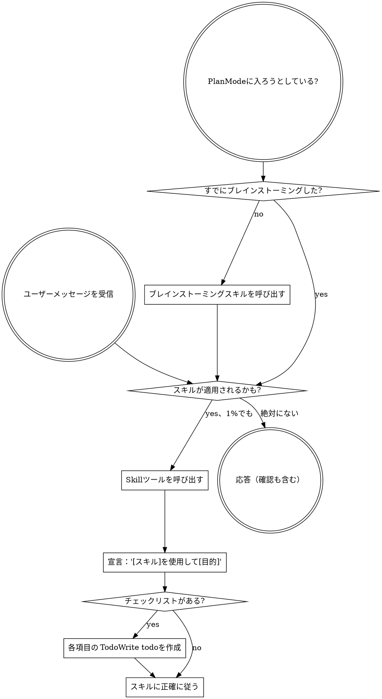

<SUBAGENT-STOP>
特定のタスクを実行するためにサブエージェントとしてディスパッチされた場合は、このスキルをスキップする。
</SUBAGENT-STOP>

<EXTREMELY-IMPORTANT>
スキルが適用されるかもしれないと1%でも思ったら、絶対にそのスキルを呼び出さなければならない。

タスクにスキルが適用される場合、選択の余地はない。必ず使用しなければならない。

これは交渉できない。これはオプションではない。これを合理化で回避することはできない。
</EXTREMELY-IMPORTANT>

## 指示の優先順位

Superpowersのスキルはデフォルトのシステムプロンプトの動作をオーバーライドするが、**ユーザーの指示は常に優先される**：

1. **ユーザーの明示的な指示**（CLAUDE.md、GEMINI.md、AGENTS.md、直接のリクエスト）— 最高優先度
2. **Superpowersのスキル** — 競合する場合はデフォルトのシステム動作をオーバーライド
3. **デフォルトのシステムプロンプト** — 最低優先度

CLAUDE.md が「TDDを使わない」と言い、スキルが「常にTDDを使う」と言っていれば、ユーザーの指示に従う。ユーザーがコントロールしている。

## スキルへのアクセス方法

**Claude Code の場合：** `Skill` ツールを使用する。スキルを呼び出すと、その内容が読み込まれて提示される — 直接それに従う。スキルファイルに Read ツールを使わない。

**Copilot CLI の場合：** `skill` ツールを使用する。スキルはインストールされたプラグインから自動検出される。`skill` ツールは Claude Code の `Skill` ツールと同じように動作する。

**Gemini CLI の場合：** スキルは `activate_skill` ツールを通じて有効化される。Gemini はセッション開始時にスキルのメタデータを読み込み、必要に応じてフルコンテンツを有効化する。

**他の環境の場合：** スキルの読み込み方法についてはプラットフォームのドキュメントを確認する。

## プラットフォームの適応

スキルは Claude Code のツール名を使用する。CC以外のプラットフォーム：ツールの対応については `references/copilot-tools.md`（Copilot CLI）、`references/codex-tools.md`（Codex）を参照。Gemini CLI ユーザーは GEMINI.md を通じてツールマッピングが自動的に読み込まれる。

# スキルの使用

## ルール

**関連するまたは要求されたスキルは、どんな応答やアクションの前にも呼び出す。** スキルが適用されるかもしれないという1%の可能性でもスキルを呼び出す。呼び出したスキルが状況に合わなかった場合は使わなくていい。

## 要注意サイン

これらの考えは「停止」を意味する — 合理化している：

| 考え | 現実 |
|------|------|
| 「これは単純な質問だけ」 | 質問はタスクだ。スキルを確認する。 |
| 「まずもっとコンテキストが必要」 | スキルの確認は確認の質問より前に来る。 |
| 「まずコードベースを探索する」 | スキルが探索の方法を教える。最初に確認する。 |
| 「gitやファイルをすぐに確認できる」 | ファイルには会話のコンテキストがない。スキルを確認する。 |
| 「まず情報を収集する」 | スキルが情報の収集方法を教える。 |
| 「正式なスキルは必要ない」 | スキルがあれば使う。 |
| 「このスキルを覚えている」 | スキルは進化する。現在のバージョンを読む。 |
| 「これはタスクとは言えない」 | アクション = タスク。スキルを確認する。 |
| 「スキルはやり過ぎ」 | 単純なことが複雑になる。使う。 |
| 「まずこの一つだけやる」 | 何かをする前に確認する。 |
| 「これは生産的に感じる」 | 規律のないアクションは時間を無駄にする。スキルがそれを防ぐ。 |
| 「それが何を意味するか分かる」 | 概念を知ること ≠ スキルを使うこと。呼び出す。 |

## スキルの優先順位

複数のスキルが適用できる場合、この順番を使用する：

1. **プロセススキルを最初に**（ブレインストーミング、デバッグ）— これらがタスクへのアプローチ方法を決める
2. **実装スキルを次に**（frontend-design、mcp-builder）— これらが実行をガイドする

「Xを作ろう」 → まずブレインストーミング、次に実装スキル。
「このバグを修正して」 → まずデバッグ、次にドメイン固有のスキル。

## スキルの種類

**厳格**（TDD、デバッグ）：正確に従う。規律を適応させない。

**柔軟**（パターン）：コンテキストに原則を適応させる。

スキル自体がどちらかを教える。

## ユーザーの指示

指示は何をするかを言う、どのようにするかではない。「Xを追加して」や「Yを修正して」はワークフローをスキップすることを意味しない。
