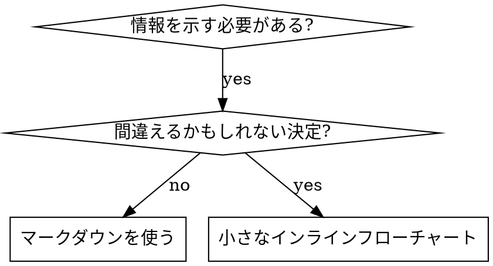

# スキルの作成

## 概要

**スキルの作成は、プロセスのドキュメントに適用されたテスト駆動開発だ。**

**個人のスキルはエージェント固有のディレクトリに置く（Claude Code は `~/.claude/skills`、Codex は `~/.agents/skills/`）**

テストケース（サブエージェントを使ったプレッシャーシナリオ）を書き、失敗を確認し（ベースラインの動作）、スキルを書き（ドキュメント）、テストが通過することを確認し（エージェントが準拠）、リファクタリングする（抜け穴を塞ぐ）。

**コア原則：** スキルなしでエージェントが失敗するのを確認しなければ、スキルが正しいことを教えているかどうか分からない。

**必須の事前知識：** このスキルを使用する前に superpowers:test-driven-development を理解していなければならない。そのスキルが基本的なレッド・グリーン・リファクターサイクルを定義している。このスキルはTDDをドキュメントに適応させる。

**公式ガイダンス：** Anthropicの公式スキル作成ベストプラクティスについては anthropic-best-practices.md を参照。このドキュメントはそのスキルのTDDフォーカスアプローチを補完する追加のパターンとガイドラインを提供する。

## スキルとは何か？

**スキル**は実績のあるテクニック・パターン・ツールのリファレンスガイドだ。スキルは将来のClaudeインスタンスが効果的なアプローチを見つけて適用するのを助ける。

**スキルは：** 再利用可能なテクニック・パターン・ツール・リファレンスガイド

**スキルではない：** 一度問題を解決した方法についての物語

## スキル作成のためのTDDマッピング

| TDDの概念 | スキルの作成 |
|---------|-----------|
| **テストケース** | サブエージェントを使ったプレッシャーシナリオ |
| **本番コード** | スキルドキュメント（SKILL.md） |
| **テスト失敗（RED）** | エージェントがスキルなしでルールに違反（ベースライン） |
| **テスト通過（GREEN）** | スキルが存在する状態でエージェントが準拠 |
| **リファクター** | コンプライアンスを維持しながら抜け穴を塞ぐ |
| **テストを先に書く** | スキルを書く前にベースラインシナリオを実行する |
| **失敗を確認する** | エージェントが自然に何をするかを文書化する |
| **最小限のコード** | それらの具体的な違反に対応するスキルを書く |
| **通過を確認する** | エージェントが今度は準拠することを確認する |
| **リファクターサイクル** | 新しい合理化を見つける → 塞ぐ → 再確認する |

スキル作成プロセス全体がレッド・グリーン・リファクターに従う。

## スキルを作成するとき

**作成する場合：**
- テクニックが直感的に明らかではなかった
- 複数のプロジェクトにわたってこれを再び参照するだろう
- パターンが広く適用できる（プロジェクト固有ではない）
- 他の人も恩恵を受ける

**作成しない場合：**
- 一回限りの解決策
- 他の場所でよく文書化されている標準的な実践
- プロジェクト固有の規約（CLAUDE.mdに入れる）
- 機械的な制約（正規表現/バリデーションで強制できるなら自動化する。判断が必要な場合のためにドキュメントを残す）

## スキルの種類

### テクニック
従うべき手順を持つ具体的な方法（condition-based-waiting、root-cause-tracing）

### パターン
問題についての考え方（flatten-with-flags、test-invariants）

### リファレンス
APIドキュメント・シンタックスガイド・ツールドキュメント（office docs）

## ディレクトリ構造

```
skills/
  skill-name/
    SKILL.md              # メインリファレンス（必須）
    supporting-file.*     # 必要な場合のみ
```

**フラットな名前空間** — すべてのスキルが1つの検索可能な名前空間にある

**別ファイルにする場合：**
1. **重いリファレンス**（100行以上）— APIドキュメント・包括的なシンタックス
2. **再利用可能なツール** — スクリプト・ユーティリティ・テンプレート

**インラインに保つ場合：**
- 原則とコンセプト
- コードパターン（50行未満）
- それ以外のすべて

## SKILL.md の構造

**フロントマター（YAML）：**
- 2つの必須フィールド：`name` と `description`（すべてのサポートフィールドについては [agentskills.io/specification](https://agentskills.io/specification) を参照）
- 最大1024文字
- `name`：文字・数字・ハイフンのみ使用（括弧・特殊文字不可）
- `description`：三人称で、いつ使用するかのみを説明（何をするかは説明しない）
  - トリガー条件に集中するために「使用する場合...」で始める
  - 具体的な症状・状況・コンテキストを含める
  - **スキルのプロセスやワークフローを決して要約しない**（理由はCSOセクション参照）
  - 可能であれば500文字未満に保つ

```markdown
---
name: Skill-Name-With-Hyphens
description: [具体的なトリガー条件と症状]のときに使用する
---

# スキル名

## 概要
これは何か？1〜2文でコアな原則。

## 使用するとき
[決定が明白でない場合の小さなインラインフローチャート]

症状と使用ケースの箇条書きリスト
使用しない場合

## コアパターン（テクニック/パターンの場合）
前後のコード比較

## クイックリファレンス
一般的な操作をスキャンするためのテーブルまたは箇条書き

## 実装
シンプルなパターンはインラインコード
重いリファレンスや再利用可能なツールはファイルへのリンク

## よくある間違い
何が問題になるか + 修正

## 現実の効果（オプション）
具体的な結果
```

## Claude 検索最適化（CSO）

**発見のために重要：** 将来のClaudeがスキルを見つける必要がある

### 1. 豊かなdescriptionフィールド

**目的：** Claudeはdescriptionを読んで、特定のタスクにどのスキルを読み込むかを決める。「今すぐこのスキルを読むべきか？」に答えるようにする。

**フォーマット：** トリガー条件に集中するために「使用する場合...」で始める

**重要：description = いつ使うか、スキルが何をするかではない**

descriptionはトリガー条件のみを説明すべきだ。スキルのプロセスやワークフローをdescriptionに要約してはいけない。

**なぜ重要か：** テストにより、descriptionがスキルのワークフローを要約していると、Claudeはフルスキルコンテンツを読む代わりにdescriptionに従う可能性があることが分かった。「タスク間でコードレビューを行う」というdescriptionがClaudeに1回のレビューのみ行わせた。スキルのフローチャートが明確に2回のレビュー（仕様準拠次にコード品質）を示していたにもかかわらず。

descriptionが「独立したタスクを持つ実装計画を実行するときに使用する」（ワークフローの要約なし）に変更されたとき、Claudeはフローチャートをきちんとこなしてたり、2段階のレビュープロセスに正しく従った。

**罠：** ワークフローを要約するdescriptionはClaudeが取るショートカットを作る。スキルの本文はClaudeがスキップするドキュメントになる。

```yaml
# ❌ 悪い：ワークフローを要約 — Claudeがこれに従う可能性がある
description: 計画を実行するときに使用する — タスク間でコードレビューを行ってタスクごとにサブエージェントをディスパッチ

# ❌ 悪い：プロセスの詳細が多すぎる
description: TDDのために使用する — 最初にテストを書く、失敗を確認する、最小限のコードを書く、リファクター

# ✅ 良い：トリガー条件のみ、ワークフローの要約なし
description: 現在のセッションで独立したタスクを持つ実装計画を実行するときに使用する

# ✅ 良い：トリガー条件のみ
description: 機能やバグ修正を実装するとき、実装コードを書く前に使用する
```

**コンテンツ：**
- このスキルが適用されることを示す具体的なトリガー・症状・状況を使う
- 言語固有の症状ではなく「問題」（レースコンディション・不一致な動作）を説明する
- スキル自体が技術固有でない限り、技術に依存しないトリガーを書く
- スキルが技術固有の場合、トリガーでそれを明示する
- 三人称で書く（システムプロンプトに挿入される）
- **スキルのプロセスやワークフローを決して要約しない**

### 2. キーワードカバレッジ

Claudeが検索するであろう言葉を使う：
- エラーメッセージ：「Hook timed out」「ENOTEMPTY」「race condition」
- 症状：「flaky」「hanging」「zombie」「pollution」
- 同義語：「timeout/hang/freeze」「cleanup/teardown/afterEach」
- ツール：実際のコマンド・ライブラリ名・ファイルタイプ

### 3. 説明的な命名

**能動態、動詞先行を使う：**
- ✅ `creating-skills` ではなく `skill-creation`
- ✅ `condition-based-waiting` ではなく `async-test-helpers`

### 4. トークンの効率（重要）

**問題：** getting-startedと頻繁に参照されるスキルはすべての会話に読み込まれる。すべてのトークンが重要だ。

**目標の語数：**
- getting-startedワークフロー：それぞれ150語未満
- 頻繁に読み込まれるスキル：合計200語未満
- 他のスキル：500語未満（それでも簡潔に）

**テクニック：**

**ツールのヘルプに詳細を移す：**
```bash
# ❌ 悪い：SKILL.mdにすべてのフラグを文書化する
search-conversations は --text、--both、--after DATE、--before DATE、--limit N をサポート

# ✅ 良い：--help を参照する
search-conversations は複数のモードとフィルターをサポートする。詳細は --help を実行。
```

**クロスリファレンスを使う：**
```markdown
# ❌ 悪い：ワークフローの詳細を繰り返す
検索時は、テンプレートを使ってサブエージェントをディスパッチする...
[繰り返しの20行]

# ✅ 良い：他のスキルを参照する
常にサブエージェントを使う（50〜100倍のコンテキスト節約）。必須：ワークフローには [other-skill-name] を使用する。
```

### 5. 他のスキルのクロスリファレンス

**他のスキルを参照するドキュメントを書くとき：**

スキル名のみを使用し、明示的な要件マーカーを付ける：
- ✅ 良い：`**必須サブスキル：** superpowers:test-driven-development を使用する`
- ✅ 良い：`**必須の事前知識：** superpowers:systematic-debugging を理解していなければならない`
- ❌ 悪い：`skills/testing/test-driven-development を参照`（必須かどうか不明）
- ❌ 悪い：`@skills/testing/test-driven-development/SKILL.md`（強制読み込み、コンテキストを消費）

**@リンクを使わない理由：** `@` 構文はすぐにファイルを強制読み込みし、必要になる前に200k以上のコンテキストを消費する。

## フローチャートの使用



**フローチャートを使う場合のみ：**
- 明白でない決定ポイント
- 早すぎる段階で停止するかもしれないプロセスのループ
- 「AとBのどちらを使うか」の決定

**フローチャートを使わない場合：**
- リファレンス素材 → テーブル・リスト
- コード例 → マークダウンブロック
- 線形の指示 → 番号付きリスト
- 意味のないラベル（step1、helper2）

graphvizのスタイルルールについては @graphviz-conventions.dot を参照。

**ヒューマンパートナーのための可視化：** このディレクトリの `render-graphs.js` を使用してスキルのフローチャートをSVGにレンダリングする：
```bash
./render-graphs.js ../some-skill           # 各ダイアグラムを個別に
./render-graphs.js ../some-skill --combine # すべてのダイアグラムを1つのSVGに
```

## コード例

**多くの平凡な例より1つの優れた例の方が良い**

最も関連性の高い言語を選ぶ：
- テストテクニック → TypeScript/JavaScript
- システムデバッグ → Shell/Python
- データ処理 → Python

**良い例：**
- 完全で実行可能
- なぜかを説明するコメントが付いている
- 実際のシナリオから
- パターンを明確に示す
- 適応しやすい（汎用テンプレートではない）

**しないこと：**
- 5言語以上で実装する
- 穴埋めテンプレートを作成する
- 作り話の例を書く

移植が得意なので、1つの優れた例で十分だ。

## 鉄則（TDDと同じ）

```
失敗するテストなしにスキルを作成してはならない
```

これは新しいスキルにも既存スキルの編集にも適用される。

テストより前にスキルを書いた？ 削除する。最初からやり直す。
テストなしにスキルを編集した？ 同じ違反だ。

**例外なし：**
- 「単純な追加」のためでもない
- 「セクションを追加するだけ」のためでもない
- 「ドキュメントの更新」のためでもない
- テストされていない変更を「参照として」保持しない
- テストを実行しながら「適応させ」ない
- 削除は削除を意味する

**必須の事前知識：** superpowers:test-driven-development スキルがなぜこれが重要かを説明する。同じ原則がドキュメントに適用される。

## すべてのスキルタイプのテスト

スキルの種類ごとに異なるテストアプローチが必要：

### 規律強制スキル（ルール/要件）

**例：** TDD・verification-before-completion・designing-before-coding

**以下でテストする：**
- 学術的な質問：ルールを理解しているか？
- プレッシャーシナリオ：プレッシャー下でも準拠するか？
- 複数のプレッシャーの組み合わせ：時間 + サンクコスト + 疲労
- 合理化を特定して明示的な反論を追加する

**成功基準：** エージェントが最大プレッシャー下でルールに従う

### テクニックスキル（ハウツーガイド）

**例：** condition-based-waiting・root-cause-tracing・defensive-programming

**以下でテストする：**
- 応用シナリオ：テクニックを正しく適用できるか？
- バリエーションシナリオ：エッジケースを処理するか？
- 情報欠落テスト：指示にギャップがあるか？

**成功基準：** エージェントが新しいシナリオにテクニックを正常に適用する

### パターンスキル（メンタルモデル）

**例：** reducing-complexity・information-hidingコンセプト

**以下でテストする：**
- 認識シナリオ：パターンが適用されるときを認識するか？
- 応用シナリオ：メンタルモデルを使用できるか？
- 反例：パターンを使わない場合を知っているか？

**成功基準：** エージェントがパターンをいつ/どのように適用するかを正しく特定する

### リファレンススキル（ドキュメント/API）

**例：** APIドキュメント・コマンドリファレンス・ライブラリガイド

**以下でテストする：**
- 検索シナリオ：正しい情報を見つけられるか？
- 応用シナリオ：見つけたものを正しく使用できるか？
- ギャップテスト：一般的な使用ケースがカバーされているか？

**成功基準：** エージェントがリファレンス情報を見つけて正しく適用する

## スキルの作成チェックリスト（TDD適応版）

**重要：以下の各チェックリスト項目のために TodoWrite を使用して todo を作成する。**

**REDフェーズ — 失敗するテストを書く：**
- [ ] プレッシャーシナリオを作成する（規律スキルは3つ以上の組み合わされたプレッシャー）
- [ ] スキルなしでシナリオを実行する — ベースラインの動作を逐語的に文書化する
- [ ] 合理化/失敗のパターンを特定する

**GREENフェーズ — 最小限のスキルを書く：**
- [ ] 名前は文字・数字・ハイフンのみ使用（括弧/特殊文字不可）
- [ ] 必須の `name` と `description` フィールドを持つ YAML フロントマター（最大1024文字；[仕様](https://agentskills.io/specification)参照）
- [ ] descriptionが「使用する場合...」で始まり、具体的なトリガー/症状を含む
- [ ] descriptionが三人称で書かれている
- [ ] 検索のためのキーワード（エラー・症状・ツール）が全体にある
- [ ] コアな原則を持つ明確な概要
- [ ] REDで特定された具体的なベースラインの失敗に対応
- [ ] コードはインラインまたは別ファイルへのリンク
- [ ] 1つの優れた例（複数言語ではない）
- [ ] スキルありでシナリオを実行する — エージェントが今度は準拠することを確認する

**REFACTORフェーズ — 抜け穴を塞ぐ：**
- [ ] テストから新しい合理化を特定する
- [ ] 明示的な反論を追加する（規律スキルの場合）
- [ ] すべてのテストイテレーションから合理化テーブルを構築する
- [ ] 赤信号リストを作成する
- [ ] 完全に機能するまで再テストする

**品質チェック：**
- [ ] 決定が明白でない場合のみ小さなフローチャート
- [ ] クイックリファレンステーブル
- [ ] よくある間違いのセクション
- [ ] 物語的なストーリーテリングなし
- [ ] ツールまたは重いリファレンスのみサポートファイル

**デプロイ：**
- [ ] スキルを git にコミットしてフォークにプッシュ（設定されている場合）
- [ ] 広く有用な場合はPRでコントリビューションを検討する

## 発見のワークフロー

将来のClaudeがスキルを見つける方法：

1. **問題に遭遇する**（「テストがフレーキー」）
2. **SKILLを見つける**（descriptionが一致する）
3. **概要をスキャンする**（関連しているか？）
4. **パターンを読む**（クイックリファレンステーブル）
5. **例を読み込む**（実装するときのみ）

**このフローのために最適化する** — 検索可能な用語を早く・頻繁に配置する。

## まとめ

**スキルの作成はプロセスのドキュメントのためのTDDだ。**

同じ鉄則：失敗するテストなしにスキルを作成しない。
同じサイクル：RED（ベースライン）→ GREEN（スキルを書く）→ REFACTOR（抜け穴を塞ぐ）。
同じメリット：より高品質・少ない驚き・完全に機能する結果。

コードにTDDに従うなら、スキルにも従う。同じ規律をドキュメントに適用したものだ。
