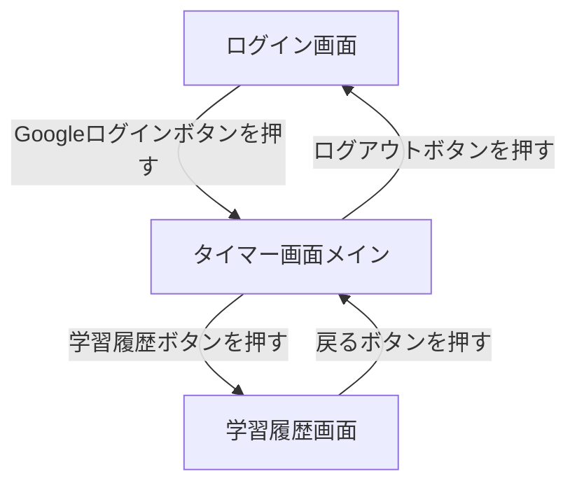
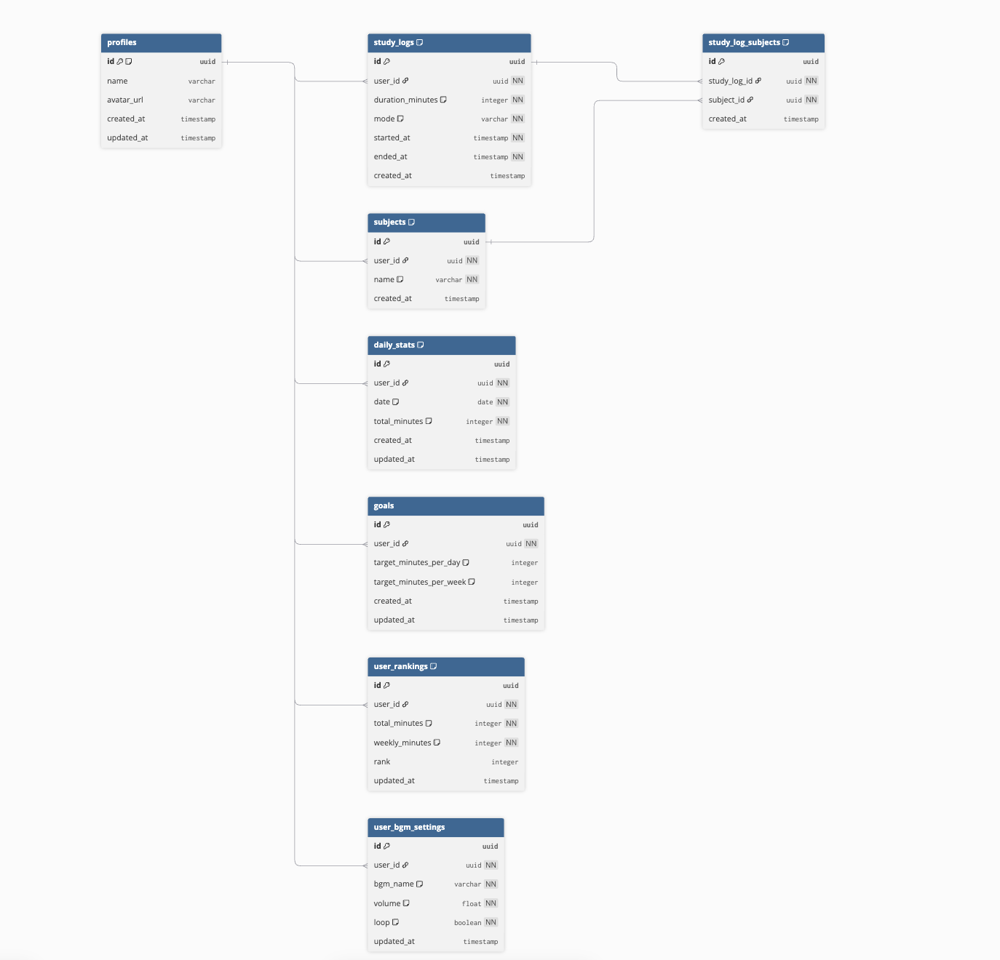

# Stupomo（スタポモ）

## サービス概要

Stupomo（スタポモ）は、ポモドーロ・テクニック（25分作業＋5分休憩）を活用して、学習や作業の集中時間を記録・管理できるWebアプリです。

ユーザーはタイマーを開始するだけで学習時間を自動的に記録でき、日別・週別の学習時間を確認することで継続的な学習習慣を作ることができます。

また、集中用BGM（MP3）をアプリ内で再生できるため、学習環境を整えながら作業を進めることが可能です。

---

## 開発背景

プログラミング学習を継続する中で、集中できる時間帯とできない時間帯の差が大きいことに悩んでいました。また、学習時間を記録しようとしても、手動でメモを取るのは面倒で続かないという課題がありました。

そこで、ポモドーロタイマーを使って「集中と休憩を強制的に切り替える」ことで学習効率を高めつつ、学習時間を自動で記録できるアプリがあれば便利だと考えました。

学習記録が蓄積されることで、モチベーション維持にもつながると考え、Stupomoを開発しました。

---

## ユーザー層

- プログラミング学習をしている人
- 資格勉強をしている人
- 作業の集中力を高めたい人
- 学習記録を残して習慣化したい人
- 日々の努力を可視化したい人

---

## サービスの利用イメージ

1. ユーザー登録・ログイン（Googleログイン）
2. ポモドーロタイマーを開始する
3. 作業時間（25分）終了後に休憩時間（5分）へ切り替わる
4. セッション終了時に学習記録が保存される
5. 学習履歴ページで日別・週別の合計時間を確認できる
6. 集中用BGMを再生しながら学習できる

---

## 機能一覧

### MVP

- **認証機能**（Supabase Auth）
  - Googleログイン / ログアウト
- **ポモドーロタイマー機能**
  - 25分作業 / 5分休憩の切り替え
  - タイマー開始 / 停止 / リセット
- **学習記録機能**
  - 学習時間の保存
  - 今日の学習時間合計の表示
  - 学習履歴一覧表示
- **BGM機能**
  - MP3再生 / 音量調整 / ループ再生

### 本リリース予定

- 学習科目タグ機能
- 週・月単位のグラフ表示
- streak（連続学習日数）機能
- 目標学習時間設定機能
- ランキング機能

---

## 使用技術スタック

| カテゴリ | 技術 |
|---|---|
| フロントエンド | Next.js / TypeScript |
| UI | Tailwind CSS |
| 認証 | Supabase Auth |
| データベース | Supabase（PostgreSQL） |
| インフラ | Vercel |
| 開発環境 | Docker / Supabase CLI |
| その他 | localStorage（タイマー状態保持） |

---

## 技術選定理由

| 技術 | 選定理由 |
|---|---|
| Next.js / TypeScript | 学習目的で選定。型安全に開発でき、App RouterでSSRも扱える |
| Tailwind CSS | クラス名だけでスタイリングが完結し、開発テンポを落とさない |
| Supabase Auth | Googleログインを数行で実装でき、JWT管理も不要 |
| Supabase（PostgreSQL） | 認証・DB・APIを一括管理でき、個人開発に最適 |
| Vercel | Next.jsとの親和性が高く、GitHubと連携して自動デプロイ可能 |
| Docker / Supabase CLI | 本番DBを触らずローカルで開発でき、環境を再現しやすい |
| localStorage | ブラウザにタイマー状態を保持し、リロードしても継続できる |

---

## サービスの差別化ポイント

### 1. 学習時間の自動記録

タイマーを動かすだけで学習時間が記録されるため、手動での入力が不要で継続しやすい設計になっています。

### 2. 日別・週別の学習時間を可視化

学習記録を集計して表示することで、自分の努力を数字として振り返ることができます。

### 3. 集中用BGMをアプリ内で再生可能

アプリ内で集中用BGM（MP3）を再生できるため、環境を整えて学習を開始できます。

---

## 画面遷移図

> 現在Figmaでのデザイン作成中です。完成までしばらくお待ちください。

---

## ER図

